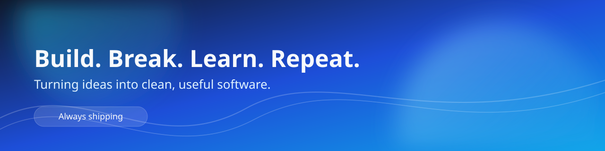

  

<h1 align="center">Hi, I am Taha Ansari</h1>

  <strong>Software Developer</strong> who likes building practical products, clean systems, and useful developer workflows.

  
  
  

---

## About me
- I am currently working on: YOUR_CURRENT_PROJECT.
- I am currently learning: TOPIC_1, TOPIC_2.
- I care about: DX, performance, readability, and shipping value.
- Fun fact: ADD_A_SHORT_FUN_FACT.

## Tech I use

  

## Highlights
- Built: PROJECT_HIGHLIGHT_1.
- Improved: PROJECT_HIGHLIGHT_2.
- Exploring: PROJECT_HIGHLIGHT_3.

## Featured projects
| Project | What it does | Stack |
|---|---|---|
| [PROJECT_NAME_1](https://github.com/imTaha76/REPO_1) | ONE_LINE_DESCRIPTION | STACK |
| [PROJECT_NAME_2](https://github.com/imTaha76/REPO_2) | ONE_LINE_DESCRIPTION | STACK |
| [PROJECT_NAME_3](https://github.com/imTaha76/REPO_3) | ONE_LINE_DESCRIPTION | STACK |

## GitHub stats

  
  

## Activity graph

  

## Let us connect
- Portfolio: https://YOUR_DOMAIN
- LinkedIn: https://www.linkedin.com/in/tahansari6254/
- Email: YOUR_EMAIL@example.com

---

## Quick setup
1. Rename this repository to exactly your GitHub username.
2. Replace remaining placeholders:
  - YOUR_EMAIL
  - YOUR_CURRENT_PROJECT
  - TOPIC_1 / TOPIC_2
  - PROJECT_HIGHLIGHT_1 / 2 / 3
  - PROJECT_NAME_1 / 2 / 3
3. Commit and push.
4. Check your profile page: https://github.com/imTaha76

If you want, I can also generate a version tailored to your exact name, role, links, and preferred tech stack.
